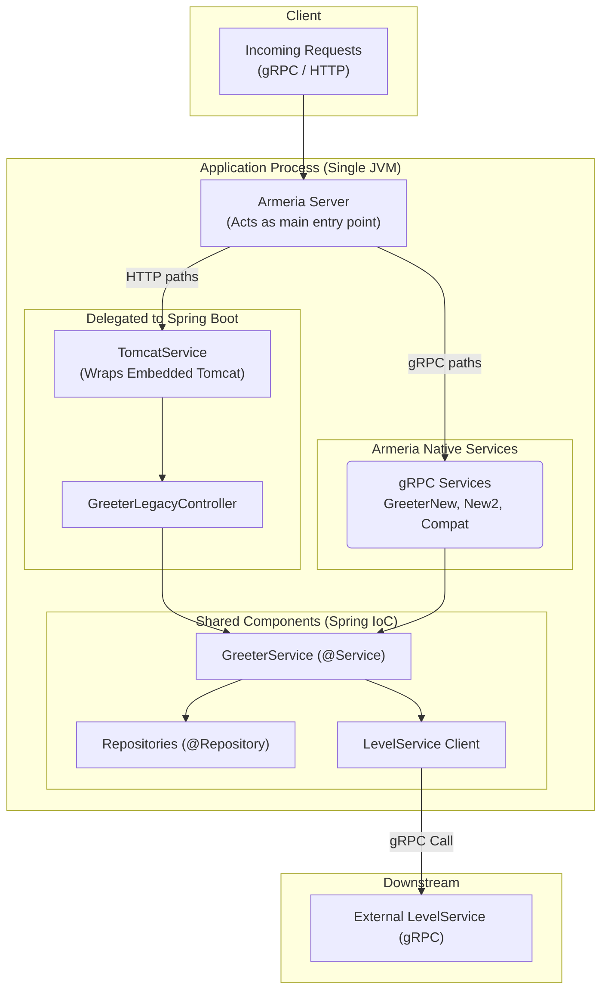

# ArmeriaOnSpring: Gradual gRPC Integration with Spring Boot

[](https://kotlinlang.org)
[](https://spring.io/projects/spring-boot)
[](https://grpc.io)
[](https://armeria.dev)
[](https://gradle.org)

A sample project demonstrating a seamless, gradual integration of a high-performance Armeria gRPC server into an existing Spring Boot application.


This project serves as a blueprint for evolving a monolithic Spring Boot application towards a microservices architecture, showcasing a robust, unified exception handling model for modern distributed systems.

## ✨ Key Features

-   **Hybrid Server Architecture**: Runs both Spring Web MVC (on Tomcat) and an Armeria gRPC server in a single JVM, allowing for gradual migration.
-   **Unified Dependency Injection**: All components, whether REST controllers or gRPC services, are managed by Spring's IoC container, enabling seamless reuse of business logic.
-   **Advanced Exception Handling**: Implements a sophisticated and standardized error propagation mechanism, crucial for resilient microservices.
-   **Multiple gRPC Flavors**: Demonstrates blocking, non-blocking (coroutine-based), and gRPC-to-REST transcoding services.

---

## 🏛️ Architecture Overview

This project operates a hybrid server model where Armeria and Spring's embedded Tomcat coexist. Armeria acts as the main server, handling all incoming traffic. It serves gRPC requests natively and delegates all other requests (like those for Spring MVC controllers) to the embedded Tomcat instance via `TomcatService`.

They share a single Spring `ApplicationContext`, allowing Armeria's gRPC services and Spring's MVC controllers to be injected with the same service and repository beans.



---

## 🔧 Standardized Exception Handling Workflow

The core of this project is its exception handling utility suite, designed for clear and consistent error propagation in an MSA environment. The `GreeterService` demonstrates five practical scenarios.

All custom exceptions are caught and translated into standard gRPC statuses and metadata by Armeria's `googleRpcStatusExceptionHandler`.

<details>
<summary><strong>Case 1: Immediately Returning an Intentional Error (`GrpcErrorException`)</strong></summary>

The most direct way to return a predefined gRPC error. The logic immediately stops and returns a specific error to the client.

```kotlin
// GreeterService.kt

// If the user is not found, immediately throw a GrpcErrorException.
val user = userDslRepository.findByName(name)
    ?: throw GrpcErrorException(GreeterNewError.GREETER_NEW_ERROR_USER_NOT_FOUND)
```

</details>

<details>
<summary><strong>Case 2: Converting a Generic Exception to a Specific gRPC Error (`simpleCatch`)</strong></summary>

Catches any `Throwable` within a logic block and converts it to a specified gRPC error. This is useful for treating all errors in a particular context identically.

```kotlin
// GreeterService.kt

// Any exception inside this block is converted to the USER_INVALID error.
simpleCatch(
    GreeterNewError.GREETER_NEW_ERROR_USER_INVALID
) {
    userInternalService.checkUserInvalid(user)
}
```
</details>

<details>
<summary><strong>Case 3: Mapping Specific Exception Types to gRPC Errors (`throwableMapCatch`)</strong></summary>

Maps different gRPC errors based on the `Throwable` type. For example, `IllegalStateException` can be mapped to `USER_INVALID`, while others fall back to a default error.

```kotlin
// GreeterService.kt

// Maps IllegalStateException to USER_INVALID, others to UNSPECIFIED.
throwableMapCatch(
    mapOf(
        IllegalStateException::class.java to GreeterNewError.GREETER_NEW_ERROR_USER_INVALID
    ),
    GreeterNewError.GREETER_NEW_ERROR_UNSPECIFIED
) {
    userInternalService.checkUserState(user)
}
```
</details>

<details>
<summary><strong>Case 4: Translating Errors from an Internal Service (`errorMapCatch` + `InternalException`)</strong></summary>

Translates an `InternalException` from another service layer into a gRPC error appropriate for the current service's context. This separates error domains between services.

```kotlin
// GreeterService.kt

// Translates a BANNED_USER error from userInternalService into the Greeter service's USER_BANNED gRPC error.
val userBanned = errorMapCatch(
    mapOf(UserInternalService.Error.BANNED_USER to GreeterNewError.GREETER_NEW_ERROR_USER_BANNED),
    GreeterNewError.GREETER_NEW_ERROR_UNSPECIFIED
) {
    userInternalService.checkUserBanned(user)
}
```
</details>

<details>
<summary><strong>Case 5: Translating Errors from a Downstream gRPC Service (`errorMapCatch` + `GrpcClientCallException`)</strong></summary>

Converts a `GrpcClientCallException` from a downstream gRPC call into an error that fits the current service's context. This is a key pattern for gracefully handling service dependency failures in an MSA.

```kotlin
// GreeterService.kt

// Translates a LEVEL_SYSTEM_UNAVAILABLE error from LevelService into the Greeter service's SERVICE_UNAVAILABLE error.
val level = errorMapCatch(
    mapOf(LevelServiceError.LEVEL_SERVICE_ERROR_LEVEL_SYSTEM_UNAVAILABLE to GreeterNewError.GREETER_NEW_ERROR_SERVICE_UNAVAILABLE),
    GreeterNewError.GREETER_NEW_ERROR_UNSPECIFIED
) {
    levelGrpcClient.getLevel(getLevelRequest { this.userId = user.id!!.toString() })
}.level
```
</details>

---

## 📂 Project Structure

```
.
├── gradle/
├── src
│   ├── main
│   │   ├── kotlin/io/github/minsujang0/armeria_on_spring
│   │   │   ├── controller/    # Legacy Spring MVC Controllers
│   │   │   ├── grpc/          # gRPC Service Implementations
│   │   │   ├── service/       # Shared Business Logic Services (@Service)
│   │   │   ├── repository/    # Data Access Layer (@Repository)
│   │   │   ├── entity/        # JPA Entities
│   │   │   ├── config/        # Armeria & Spring Configurations
│   │   │   └── util/          # Core utilities (Exception Handling, etc.)
│   │   └── proto/             # .proto file definitions
│   └── test/
├── build.gradle.kts
└── README.md
```

---

## 🚀 How to Run

1.  **Clone the repository:**
    ```bash
    git clone https://github.com/minsujang0/ArmeriaOnSpring.git
    cd ArmeriaOnSpring
    ```

2.  **Build the project:**
    This command will also generate gRPC code from the `.proto` files.
    ```bash
    ./gradlew build
    ```

3.  **Run the application:**
    ```bash
    ./gradlew bootRun
    ```
The server will start on port `8080`. You can now send requests to the REST endpoints or gRPC services. 